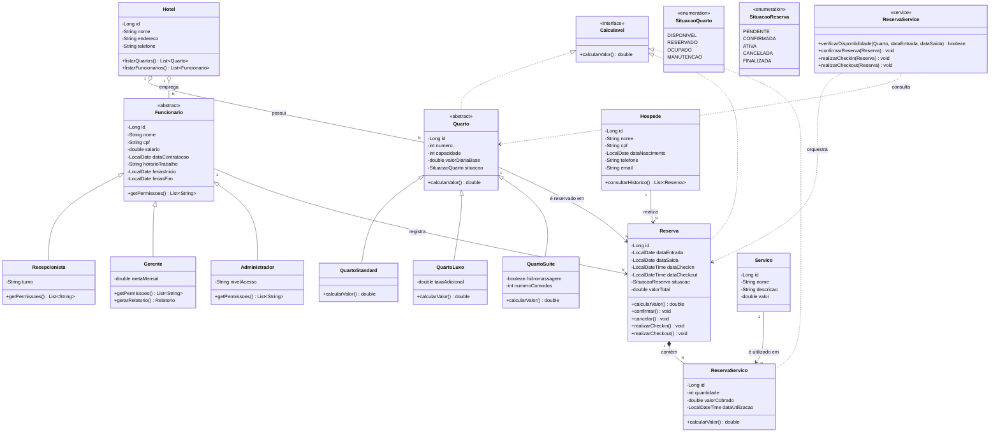

# Sistema de Gerenciamento de Rede Hoteleira — Diagrama de Classes (v2)

## Diagrama

`ReservaService` é uma classe de serviço (camada de negócio, não uma entidade persistida): concentra a verificação de disponibilidade e as transições de estado de `Reserva`/`Quarto`.

---

## Ordem recomendada de implementação

A ordem segue a dependência entre as classes: sempre implemente primeiro o que **não depende de nada**, para nunca travar esperando outra classe ainda não escrita.

| # | Classe(s) | Por quê nessa ordem |
|---|---|---|
| 1 | `SituacaoQuarto`, `SituacaoReserva` (enums) | Não dependem de nada; são usadas por várias classes depois |
| 2 | `Calculavel` (interface) | Não depende de nada; será implementada por três classes depois |
| 3 | `Hotel` | Não depende de nenhuma outra entidade do domínio |
| 4 | `Quarto` (abstract) | Depende só de `SituacaoQuarto` e `Calculavel`, já prontos |
| 5 | `QuartoStandard`, `QuartoLuxo`, `QuartoSuite` | Dependem de `Quarto` já existir |
| 6 | `Funcionario` (abstract) | Não depende de `Quarto`; pode ser feita em paralelo com o passo 4-5 |
| 7 | `Recepcionista`, `Gerente`, `Administrador` | Dependem de `Funcionario` já existir |
| 8 | `Hospede` | Não depende de nada |
| 9 | `Servico` | Não depende de nada |
| 10 | `Reserva` | Depende de `Quarto`, `Hospede`, `Funcionario` e `SituacaoReserva` — só dá para fazer depois de todas elas |
| 11 | `ReservaServico` | Depende de `Reserva` e `Servico` |
| 12 | `ReservaService` | Depende de tudo acima — é a última peça, orquestra as demais |

**Dica prática:** os passos 1–3, e depois 4-5/6-7/8-9 em paralelo, dão pra dividir entre os integrantes do grupo sem gerar conflito de dependência. `Reserva` (passo 10) só deve começar quando todo o resto já estiver pronto e compilando.
