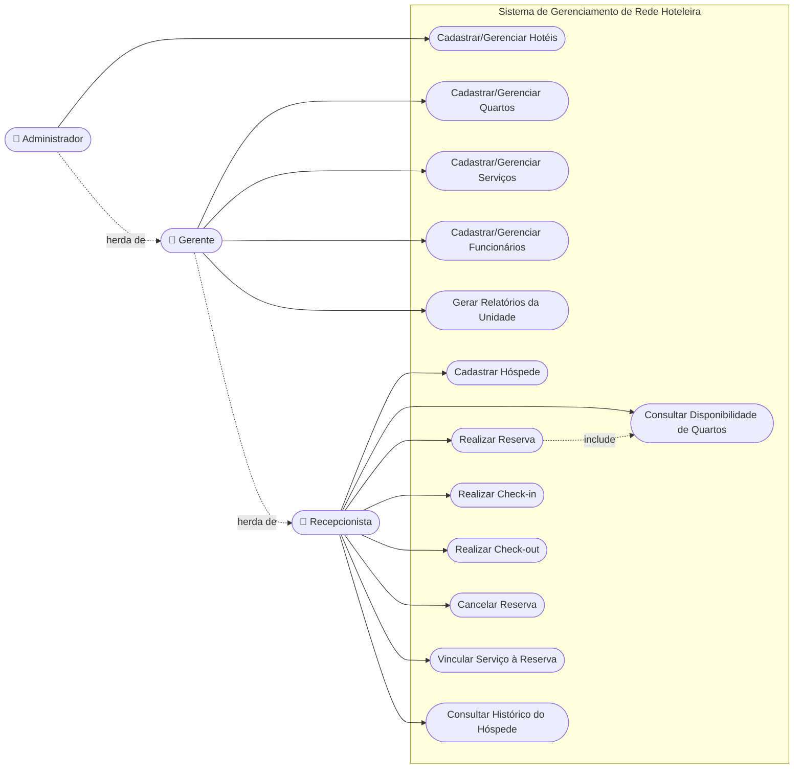
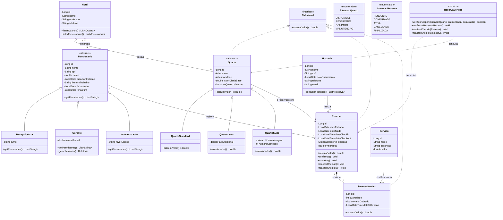
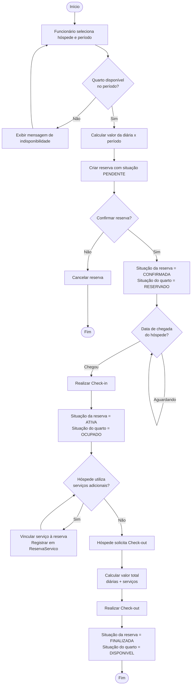

# Sistema de Gerenciamento de Rede Hoteleira — Modelagem (v2)

> **Revisão v2** — incorpora as correções apontadas na revisão técnica: estado `ATIVA` da reserva, uso efetivo do estado `RESERVADO` do quarto, remoção da checagem de disponibilidade de dentro da entidade `Quarto`, `Reserva` implementando `Calculavel`, notação de enum como atributo (não associação) e campos de férias do funcionário.

Modelagem baseada no escopo fornecido: gestão de hotéis, quartos (com tipos via herança/polimorfismo), funcionários (com cargos via herança), hóspedes, reservas e serviços, com persistência via JDBC e arquitetura MVC + DAO/Repository.

---

## 1. Diagrama de Casos de Uso

Atores: **Recepcionista**, **Gerente** e **Administrador** (todos são especializações de Funcionário, com permissões crescentes).



**Observações**
- `Gerente` herda os casos de uso de `Recepcionista` e também gerencia quartos/funcionários/serviços da sua unidade e gera relatórios.
- `Administrador` herda de `Gerente` e é o único que pode cadastrar/gerenciar hotéis (unidades da rede).
- `UC3 Realizar Reserva` agora mostra explicitamente a relação de *include* com `UC2 Consultar Disponibilidade` — antes essa relação estava documentada só em texto.

---

## 2. Diagrama de Classes (UML)

**Mudanças em relação à v1:**
- `estaDisponivel()` **saiu** de `Quarto`: a entidade não tem (e não deveria ter) acesso às reservas de outros objetos, então essa responsabilidade agora é explicitamente do `ReservaService`/`QuartoDAO`, que consulta o banco.
- `Reserva` agora implementa `Calculavel` (seu método foi renomeado para `calcularValor()`, aderindo ao contrato da interface).
- Os enums `SituacaoQuarto` e `SituacaoReserva` viraram apenas o **tipo do atributo** `situacao`, em vez de uma associação separada com multiplicidade — é a forma convencional de representar enums em UML.
- `Funcionario` ganhou `feriasInicio`/`feriasFim`, atendendo ao requisito do escopo sobre férias.



**Nota de arquitetura:** `ReservaService` é uma classe de serviço (camada de negócio, não uma entidade persistida) que concentra a verificação de disponibilidade e as transições de estado de `Reserva`/`Quarto` — é ela quem o `Recepcionista` aciona via a interface Swing, e não o próprio objeto `Quarto`.

---

## 3. Fluxograma — Processo de Reserva, Check-in e Check-out

**Mudanças em relação à v1:** o quarto agora passa por `RESERVADO` entre a confirmação e o check-in (em vez de continuar `DISPONIVEL`), e a reserva usa o novo estado `ATIVA` durante a hospedagem, deixando `FINALIZADA` só para depois do check-out.



---
## 4. MER — Modelo Entidade-Relacionamento

```mermaid
erDiagram
    HOTEL ||--o{ QUARTO : "possui"
    HOTEL ||--o{ FUNCIONARIO : "emprega"
    QUARTO ||--o| QUARTO_STANDARD : "especializa"
    QUARTO ||--o| QUARTO_LUXO : "especializa"
    QUARTO ||--o| QUARTO_SUITE : "especializa"
    FUNCIONARIO ||--o| RECEPCIONISTA : "especializa"
    FUNCIONARIO ||--o| GERENTE : "especializa"
    FUNCIONARIO ||--o| ADMINISTRADOR : "especializa"
    QUARTO ||--o{ RESERVA : "é reservado em"
    HOSPEDE ||--o{ RESERVA : "realiza"
    FUNCIONARIO ||--o{ RESERVA : "registra"
    RESERVA ||--o{ RESERVA_SERVICO : "contém"
    SERVICO ||--o{ RESERVA_SERVICO : "é utilizado em"

    HOTEL {
        int id PK
        string nome
        string endereco
        string telefone
    }
    QUARTO {
        int id PK
        int hotel_id FK
        int numero
        int capacidade
        decimal valor_diaria_base
        string tipo "STANDARD, LUXO, SUITE (discriminador)"
        string situacao "DISPONIVEL, RESERVADO, OCUPADO, MANUTENCAO"
    }
    QUARTO_STANDARD {
        int quarto_id PK_FK
    }
    QUARTO_LUXO {
        int quarto_id PK_FK
        decimal taxa_adicional
        string amenidades
    }
    QUARTO_SUITE {
        int quarto_id PK_FK
        boolean hidromassagem
        int numero_comodos
    }
    FUNCIONARIO {
        int id PK
        int hotel_id FK
        string nome
        string cpf UK
        string cargo "RECEPCIONISTA, GERENTE, ADMINISTRADOR (discriminador)"
        decimal salario
        date data_contratacao
        string horario_trabalho
        date ferias_inicio
        date ferias_fim
    }
    RECEPCIONISTA {
        int funcionario_id PK_FK
        string turno
    }
    GERENTE {
        int funcionario_id PK_FK
        decimal meta_mensal
    }
    ADMINISTRADOR {
        int funcionario_id PK_FK
        string nivel_acesso
    }
    HOSPEDE {
        int id PK
        string nome
        string cpf UK
        date data_nascimento
        string telefone
        string email
    }
    RESERVA {
        int id PK
        int quarto_id FK
        int hospede_id FK
        int funcionario_id FK
        date data_entrada
        date data_saida
        datetime data_checkin
        datetime data_checkout
        string situacao "PENDENTE, CONFIRMADA, ATIVA, CANCELADA, FINALIZADA"
        decimal valor_total
    }
    SERVICO {
        int id PK
        int hotel_id FK
        string nome
        string descricao
        decimal valor
    }
    RESERVA_SERVICO {
        int id PK
        int reserva_id FK
        int servico_id FK
        int quantidade
        decimal valor_cobrado
        datetime data_utilizacao
    }

## 5. Modelagem do Banco de Dados (DDL)

```sql
-- =========================================================
-- Sistema de Gerenciamento de Rede Hoteleira — Script DDL (v2)
-- =========================================================

CREATE TABLE hotel (
    id              SERIAL PRIMARY KEY,
    nome            VARCHAR(100) NOT NULL,
    endereco        VARCHAR(200) NOT NULL,
    telefone        VARCHAR(20)
);

-- Tabela-base de Quarto (atributos comuns a todas as subclasses)
CREATE TABLE quarto (
    id                  SERIAL PRIMARY KEY,
    hotel_id            INTEGER NOT NULL REFERENCES hotel(id),
    numero              INTEGER NOT NULL,
    capacidade          INTEGER NOT NULL,
    valor_diaria_base   DECIMAL(10,2) NOT NULL,
    tipo                VARCHAR(20) NOT NULL
                        CHECK (tipo IN ('STANDARD','LUXO','SUITE')), -- discriminador
    situacao            VARCHAR(20) NOT NULL DEFAULT 'DISPONIVEL'
                        CHECK (situacao IN ('DISPONIVEL','RESERVADO','OCUPADO','MANUTENCAO')),
    UNIQUE (hotel_id, numero)
);

-- Subclasses de Quarto: PK = FK para quarto.id (herança por tabela separada)
CREATE TABLE quarto_standard (
    quarto_id           INTEGER PRIMARY KEY REFERENCES quarto(id) ON DELETE CASCADE
);

CREATE TABLE quarto_luxo (
    quarto_id           INTEGER PRIMARY KEY REFERENCES quarto(id) ON DELETE CASCADE,
    taxa_adicional       DECIMAL(10,2) NOT NULL DEFAULT 0,
    amenidades           VARCHAR(200)
);

CREATE TABLE quarto_suite (
    quarto_id           INTEGER PRIMARY KEY REFERENCES quarto(id) ON DELETE CASCADE,
    hidromassagem        BOOLEAN NOT NULL DEFAULT FALSE,
    numero_comodos       INTEGER NOT NULL DEFAULT 1
);

-- Tabela-base de Funcionario (atributos comuns a todas as subclasses)
CREATE TABLE funcionario (
    id                  SERIAL PRIMARY KEY,
    hotel_id            INTEGER NOT NULL REFERENCES hotel(id),
    nome                VARCHAR(100) NOT NULL,
    cpf                 VARCHAR(14) NOT NULL UNIQUE,
    cargo               VARCHAR(20) NOT NULL
                        CHECK (cargo IN ('RECEPCIONISTA','GERENTE','ADMINISTRADOR')), -- discriminador
    salario             DECIMAL(10,2) NOT NULL,
    data_contratacao    DATE NOT NULL,
    horario_trabalho    VARCHAR(50),
    ferias_inicio       DATE,
    ferias_fim          DATE,
    CHECK (ferias_fim IS NULL OR ferias_fim > ferias_inicio)
);

-- Subclasses de Funcionario: PK = FK para funcionario.id
CREATE TABLE recepcionista (
    funcionario_id       INTEGER PRIMARY KEY REFERENCES funcionario(id) ON DELETE CASCADE,
    turno                VARCHAR(20)
);

CREATE TABLE gerente (
    funcionario_id       INTEGER PRIMARY KEY REFERENCES funcionario(id) ON DELETE CASCADE,
    meta_mensal          DECIMAL(10,2)
);

CREATE TABLE administrador (
    funcionario_id       INTEGER PRIMARY KEY REFERENCES funcionario(id) ON DELETE CASCADE,
    nivel_acesso         VARCHAR(20) NOT NULL DEFAULT 'TOTAL'
);

CREATE TABLE hospede (
    id                  SERIAL PRIMARY KEY,
    nome                VARCHAR(100) NOT NULL,
    cpf                 VARCHAR(14) NOT NULL UNIQUE,
    data_nascimento     DATE NOT NULL,
    telefone            VARCHAR(20),
    email               VARCHAR(100)
);

CREATE TABLE reserva (
    id                  SERIAL PRIMARY KEY,
    quarto_id           INTEGER NOT NULL REFERENCES quarto(id),
    hospede_id          INTEGER NOT NULL REFERENCES hospede(id),
    funcionario_id      INTEGER NOT NULL REFERENCES funcionario(id),
    data_entrada         DATE NOT NULL,
    data_saida           DATE NOT NULL,
    data_checkin         TIMESTAMP,
    data_checkout        TIMESTAMP,
    situacao             VARCHAR(20) NOT NULL DEFAULT 'PENDENTE'
                         CHECK (situacao IN ('PENDENTE','CONFIRMADA','ATIVA','CANCELADA','FINALIZADA')),
    valor_total          DECIMAL(10,2),
    CHECK (data_saida > data_entrada)
);

CREATE TABLE servico (
    id                  SERIAL PRIMARY KEY,
    hotel_id            INTEGER REFERENCES hotel(id), -- NULL = serviço padrão da rede
    nome                VARCHAR(100) NOT NULL,
    descricao           VARCHAR(200),
    valor               DECIMAL(10,2) NOT NULL
);

CREATE TABLE reserva_servico (
    id                  SERIAL PRIMARY KEY,
    reserva_id          INTEGER NOT NULL REFERENCES reserva(id),
    servico_id          INTEGER NOT NULL REFERENCES servico(id),
    quantidade          INTEGER NOT NULL DEFAULT 1,
    valor_cobrado        DECIMAL(10,2) NOT NULL,
    data_utilizacao       TIMESTAMP NOT NULL DEFAULT CURRENT_TIMESTAMP
);

-- Índices para consultas frequentes
CREATE INDEX idx_reserva_quarto   ON reserva(quarto_id);
CREATE INDEX idx_reserva_hospede  ON reserva(hospede_id);
CREATE INDEX idx_reserva_datas    ON reserva(data_entrada, data_saida);
CREATE INDEX idx_quarto_hotel     ON quarto(hotel_id);
CREATE INDEX idx_funcionario_hotel ON funcionario(hotel_id);
```

**Regras de negócio que ficam fora do banco (implementadas em Java/DAO/Service):**
- **Impedir sobreposição de datas** para o mesmo quarto ao criar/confirmar uma reserva:
  ```sql
  SELECT 1 FROM reserva
  WHERE quarto_id = ?
    AND situacao IN ('CONFIRMADA','PENDENTE','ATIVA') -- v2: inclui ATIVA
    AND (data_entrada, data_saida) OVERLAPS (?, ?);
  ```
  *(correção v2 — na v1 esse filtro não incluía o estado de "hóspede atualmente hospedado", permitindo sobreposição indevida)*
- **Cálculo polimórfico** de `valor_diaria` conforme o `tipo` do quarto — o `QuartoDAO` consulta `quarto` e faz `JOIN` com a tabela filha correta, montando o objeto Java da subclasse certa, que então executa seu próprio `calcularValor()`.
- **Persistência de herança:** ao persistir um `Quarto`/`Funcionario`, o DAO faz duas operações — `INSERT` na tabela-base e `INSERT` na tabela filha — dentro da mesma transação JDBC (`commit`/`rollback`).
- **Transições de estado (v2, centralizadas em `ReservaService`):**
  - Confirmar reserva → `reserva.situacao = CONFIRMADA` e `quarto.situacao = RESERVADO`
  - Check-in → `reserva.situacao = ATIVA` e `quarto.situacao = OCUPADO`
  - Check-out → `reserva.situacao = FINALIZADA` e `quarto.situacao = DISPONIVEL`
  - Cancelar → `reserva.situacao = CANCELADA` e, se o quarto estava `RESERVADO` só por essa reserva, `quarto.situacao = DISPONIVEL`
- **Verificação de disponibilidade** (`ReservaService.verificarDisponibilidade`) não é mais um método de `Quarto`: é uma consulta que cruza `quarto.situacao` com a tabela `reserva` para o período pedido.

**Exemplo de consulta com JOIN (buscar um quarto do tipo Luxo com seus dados completos):**
```sql
SELECT q.*, ql.taxa_adicional, ql.amenidades
FROM quarto q
JOIN quarto_luxo ql ON ql.quarto_id = q.id
WHERE q.id = ?;
```

---

## Resumo das mudanças da v1 para a v2

| # | Item | v1 | v2 |
|---|------|----|----|
| 1 | Estado da reserva no check-in | `FINALIZADA/ATIVA` (ambíguo, não existia no CHECK) | `ATIVA` (novo valor no enum e no CHECK) |
| 2 | Filtro de sobreposição de datas | `IN ('CONFIRMADA','PENDENTE')` | `IN ('CONFIRMADA','PENDENTE','ATIVA')` |
| 3 | Estado `RESERVADO` do quarto | Definido mas nunca atribuído | Atribuído ao confirmar a reserva |
| 4 | `estaDisponivel()` | Método de instância em `Quarto` | Removido de `Quarto`; vira `ReservaService.verificarDisponibilidade()` |
| 5 | `Reserva` e `Calculavel` | Não implementava a interface | Implementa `Calculavel`; método renomeado para `calcularValor()` |
| 6 | Enums no diagrama de classes | Associação com multiplicidade | Atributo tipado (notação convencional) |
| 7 | Férias do funcionário | Não modelado | `ferias_inicio` / `ferias_fim` em `funcionario` |

Isso cobre os 5 artefatos pedidos: caso de uso, classes (UML), fluxograma, MER e o script de criação do banco, agora com as inconsistências da v1 corrigidas.
